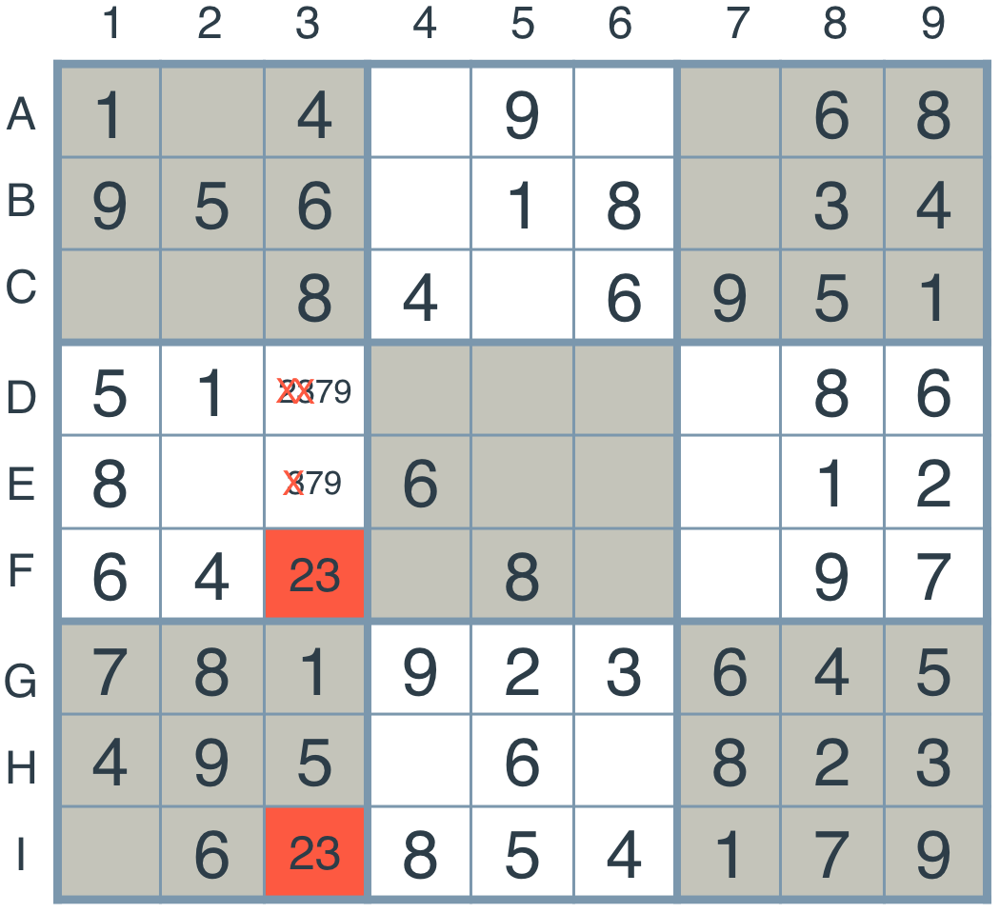

# Artificial Intelligence Nanodegree
## Introductory Project: Diagonal Sudoku Solver

# Question 1 (Naked Twins)
Q: How do we use constraint propagation to solve the naked twins problem?  
A: Constraint propagation is the process of determining how the
constraints and the possible values of one variable affect the possible values of other variables. It is an important form of “least-commitment”
reasoning(referenced from [here](http://ai.stanford.edu/~latombe/cs121/2011/slides/H-const-prop.pdf)).

Naked Twins is a strategy to exclude possibilities in a group. As we can see, in the unit 3[A-I], both F3 and I3 are
permitted with values of 2 and 3, which excludes possibilities that 2 and 3 could occur in other positions in this 
unit. In other words, it's not possible that 2 or 3 will occur in D3 or E3.



###### Implementation

1. Iterate through all the units(3x3 or 1x9 or 9x1), which provides local
constraints thus helps narrow possibilities.
2. Find possible result strings that occur more than once('23' in the above example). Twins will occur twice, triples
will occur three times, etc.
3. Once the twins are identified, iterate through all the other boxes in the same unit, 
remove the possibility(remove 2,3 from all boxes in 3[A-I] except F3 and I3).

###### Usage

This strategy can be used in conjunction with ```eliminate```
and ```only_choice```a as part of the iteration.


# Question 2 (Diagonal Sudoku)
Q: How do we use constraint propagation to solve the diagonal sudoku problem?  
A: Diagonal Sudoku can be considered a regular sudoku with two more units - two main diagonals. We can solve it by 
adding these two new units to existing unitlist.

### Install

This project requires **Python 3**.

We recommend students install [Anaconda](https://www.continuum.io/downloads), a pre-packaged Python distribution that contains all of the necessary libraries and software for this project. 
Please try using the environment we provided in the Anaconda lesson of the Nanodegree.

##### Optional: Pygame

Optionally, you can also install pygame if you want to see your visualization. If you've followed our instructions for setting up our conda environment, you should be all set.

If not, please see how to download pygame [here](http://www.pygame.org/download.shtml).

### Code

* `solutions.py` - You'll fill this in as part of your solution.
* `solution_test.py` - Do not modify this. You can test your solution by running `python solution_test.py`.
* `PySudoku.py` - Do not modify this. This is code for visualizing your solution.
* `visualize.py` - Do not modify this. This is code for visualizing your solution.

### Visualizing

To visualize your solution, please only assign values to the values_dict using the ```assign_values``` function provided in solution.py

### Data

The data consists of a text file of diagonal sudokus for you to solve.